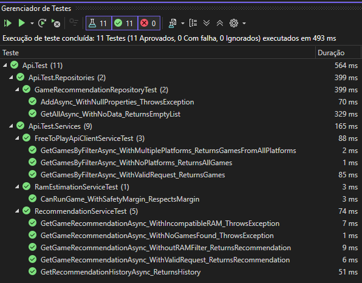

# 🎮 ChallengeLevelUP - Game Recommendation API


#### **Uma API sofisticada de recomendação de jogos free-to-play baseada em DDD**  

#### **A ChallengeLevelUP é uma API RESTful desenvolvida em .NET 8 que resolve o desafio de recomendar jogos gratuitos para usuários com base em seus gostos e limitações técnicas. A API integra-se com a Free-To-Play Games Database para fornecer recomendações personalizadas e inteligentes.**

#### **✨ Como Resolvi o Desafio**
#### **Solução Implementada**

✅ Filtros de usuário Validação robusta com Data Annotations e FluentValidation

✅ Integração com API externaClient HTTP resiliente com tratamento de erros

✅ Recomendação aleatória Algoritmo de seleção randômica entre jogos válidos

✅ Persistência com ORM Entity Framework Core com padrão Repository

✅ Histórico de recomendações Endpoint dedicado com ordenação por data

✅ Código testável Arquitetura em camadas com injeção de dependência

#### **O projeto segue rigorosamente os princípios do DDD com separação clara de responsabilidades:**

📁 ChallengeLevelUP.sln

├── 🌐 1. Services

│ ├── API

│ ├── Controllers

│ ├── appsettings.json


├── 🎯 2. Application

│ ├── Api.Application → Camada de Aplicação

│ ├── Dtos/ → Objetos de Transferência de Dados

│ ├── Interfaces/ → Contratos de serviços

└── Mappers/ → Mapeamento

├── 🏰 3. Domain 

│ ├── Api.Core → Contratos de Domínio

│ ├── Api.Domain → Camada de Domínio

│ ├── Api.Services → Serviços Externos

└──  Api.Test → Testes Automatizados


├── 🔧 4. Infra

│ ├── Api.Infra → Camada de Infraestrutura

│ ├── CrossCutting/ → IoC e configurações

│ ├── Data/ → Entity Framework

│ └── Repositories/ → Implementações de repositório

## 🚀 Como Executar

### 📋 Pré-requisitos
- .NET 8 SDK
- Visual Studio 2022 ou VS Code

#### 1. Clone o repositório
```bash
git clone https://github.com/gnp-naul/ChallengeLevelUP.git
cd ChallengeLevelUP
```

#### 2. Restauração de pacotes
```bash
dotnet restore
```


#### 3. Execução da aplicação
```bash
dotnet run --project ChallengeLevelUP
```


#### 4. Acesse a API
```bash
Swagger UI: https://localhost:7000/swagger
```


#### 🔧 Configuração

#### **O arquivo appsettings.json já está configurado para desenvolvimento:**
```
{
  "FreeToPlayApi": {
    "BaseAddress": "https://www.freetogame.com/api/"
  },
}
```


## 📚 Endpoints

### 🎮 POST /api/recommend

#### **Recomenda um jogo baseado nos filtros do usuário**


#### **📥 Request Body**
```
{
  "genre": "shooter",
  "platforms": ["pc", "browser"],
  "availableRAM": 8
}
```

#### **📥 Response (Sucesso)**
```
{
  "title": "Overwatch 2",
  "link": "https://www.freetogame.com/open/overwatch-2",
  "genre": "Shooter",
  "platform": "PC (Windows)",
  "estimatedRequiredRAM": 0,
  "isCompatibleWithAvailableRAM": true
}
```

#### **📥 Response (Erro de Validação)**
```
{
  "type": "https://tools.ietf.org/html/rfc9110#section-15.5.1",
  "title": "Erros de validação ocorreram.",
  "status": 400,
  "errors": {
    "Genre": ["O gênero é obrigatório."]
  }
}
```

### 📜 GET /api/history

#### **Retorna o histórico de todas as recomendações**
#### **📥Response**
```
[
  {
    "id": 1,
    "title": "Overwatch 2",
    "genre": "Shooter",
    "platform": "PC (Windows)",
    "recommendedAt": "2024-01-15T10:30:00Z"
  }
]
```

### 📦 Pacotes Principais

* Microsoft.EntityFrameworkCore.InMemory - Banco em memória para testes
* FluentValidation.AspNetCore - Validação avançada
* AutoMapper - Mapeamento objeto-objeto
* xUnit + Moq - Testes unitários e mocking
* Swashbuckle.AspNetCore - Documentação Swagger

### 🔌 Integrações
* FreeToPlay Games API - Catálogo de jogos gratuitos
* HTTP Client - Comunicação com APIs externas

## 🧪 Testes

### 🎯 Estratégia de Testes
```
// Exemplo de teste unitário
[Fact]
public async Task GetGamesByFilterAsync_WithValidRequest_ReturnsGames()
{
    // Arrange
    var expectedGames = new List<ExternalGame> { /* ... */ };
    var request = new GameRecommendation { /* ... */ };
    
    // Act
    var result = await _service.GetGamesByFilterAsync(request);
    
    // Assert
    Assert.NotNull(result);
    Assert.Equal(2, result.Count);
}
```

### 📊 Cobertura de Testes

✅ Serviços de API Externa - Mock de HTTP Client

✅ Repositórios - Entity Framework InMemory

✅ Mappers - Transformação de dados

✅ Validações - Regras de negócio



## 🚧 Em Melhoria Contínua

- Cache para otimização de performance

- Rate limiting para controle de requisições

- Health checks para monitoramento

- Logging estruturado com Serilog

- Métricas e observabilidade

#### **Desenvolvido usando .NET 8 e Arquitetura Limpa**

<a href="mailto:luuan.dev@gmail.com" title="Gmail">
  </a>
<a href="https://www.linkedin.com/in/victorluanoliveira/" title="LinkedIn">
  </a>
